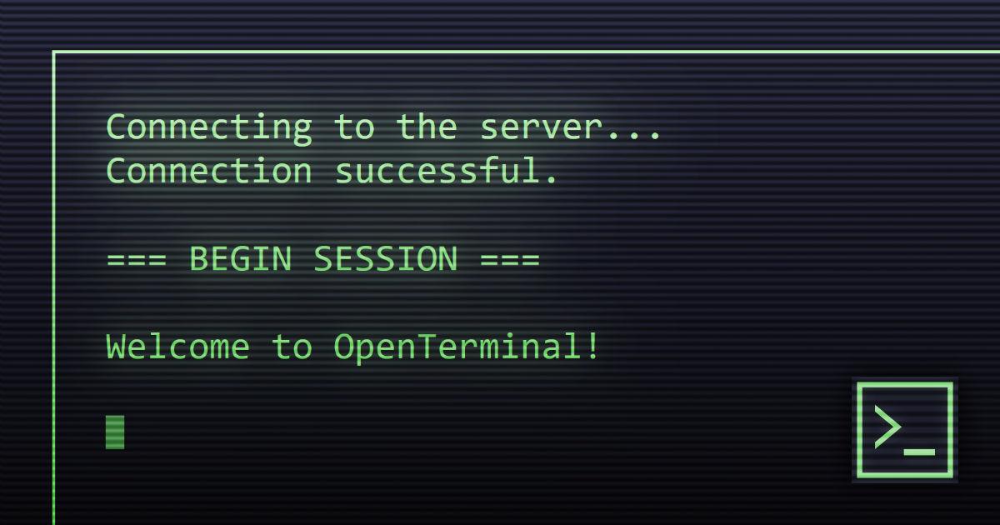

# OpenTerminal

An online terminal and communal text buffer

## how it works

a simple static web server pushes out the html, css and javascript needed to make this function well and look pretty on client devices. from there, clients connect back to the server's websocket, which they then exchange keystroke information with, back and forth, all passing through the server's own saved buffer. (if you refresh the page, everything's still there!)

### wouldn't this be really easy to grief?

yes!

jokes aside- while i do absolutely see how an open, self-moderated text buffer is hilariously easy to grief, i could also imagine users taking the concept and pushing it quite a bit further than what i'm doing here. who knows? maybe a anti-spam bot could come in, read through the buffer for any *nefarious* material, and backpedal through the buffer just enough to remove it, before replacing the otherwise above-board text from memory.

...or maybe it'll just become a garbage-posting haven. regardless, it's a fun little idea, so i made it anyway.

## hosting

- `git clone` this repo and `cd` into it
- `npm ci` to install dependencies
- `npm run start`, and you should be good to do!

OpenTerminal also makes use of environment variables for server hosts who want a bit more control of their setup:

- `OPENTERM_HOST` - the address to bind OpenTerminal's http and websocket server. (default 0.0.0.0)
- `OPENTERM_POST` - the port to bind OpenTerminal's http and websocket server. (default 8080)
- `OPENTERM_TRUSTED_PROXIES` - a comma-separated list of addresses to check for `X-Forwarded-For` headers from. handy if you run OpenTerminal behind a reverse proxy! (default none, example `"127.0.0.1,192.168.0.100"`)

## roadmap

- rewrite backend in go/rust (me no like javascript raaaahhh)
- master server (anyone can host a channel and post to the MS)

### "maybe" roadmap

- channel logs (for recovery in the event of a crash, as an optional feature)
